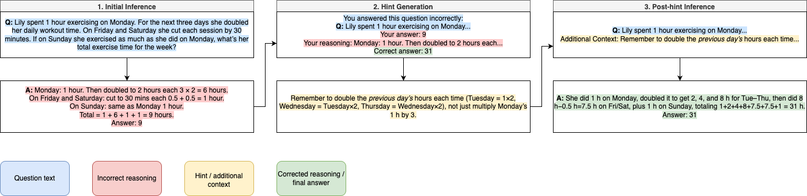

# Capstone Project: Do LLMs Know What/Where and Why They Lack?

This codebase was developed as a part of Bachelor’s capstone project in Data Science at American University of Armenia.

The project **evaluates** the self-refinement abilities of large language models (LLMs) by applying 3 steps of self-refinment method (with external data used during step 2) on arithmetic benchmark and evaluating the performance of the LLMs during step 3 - post-hint inference:




## Project Structure


  - data/ - arithmetic benchmarks
    - `asdiv.jsonl` — ASDiv benchmark samples  
    - `gsm8k.jsonl` — GSM8K benchmark samples  

  - prompts/ — prompt templates  
    - `answer_prompt.txt` — for initial answer inference  
    - `hint_prompt.txt` — for hint generation  

  - results/ — model outputs and aggregated stats  
    - gemma-2-2b-it/ — outputs for gemma-2-2b-it
    - phi-4-mini-instruct/ — outputs for phi-4-mini-instruct
    - `statistics.txt` — aggregated accuracy stats  

  - src/ — source code modules  
    - `data.py` — load and save JSONL utilities  
    - `utils.py` — prompt builders and parsers  
    - `inference.py` — solve questions and generate hints  
    - `run.py` — command line interface entry point  
    - `analysis.py` — summary statistics computation  

  - `README.md` — project overview and instructions 

  - `requirements.txt` — Python dependencies

  - paper/ - complete capstone research paper
    - `Do-the-LLMs-Know-What:Where-and-Why-They-Lack.pdf` — full final report
    - figures/ — all figures referenced in the paper


## How to Use

### 1. Install dependencies:

```
pip install -r requirements.txt
```
<br>

### 2. Run the full pipeline

This will generate initial answers, hints, and post-hint answers:

```
python src/run.py \
  --model_path <HF-model-or-local-dir> \
  --input_path data/asdiv.jsonl \
  --output_dir results/gemma-2-2b-it \
  [--max_samples N]
```

- *model_path*: Hugging Face checkpoint (e.g. `google/gemma-2-2b-it`) or local directory  
- *input_path*: JSONL file with each line `{ "question": "...", "answer": "..." }`  
- *output_dir*: Directory for three output files  
- *max_samples*: limit number of examples processed  (optional)

After running, you’ll find:

- `initial_inference.jsonl`  
- `hints.jsonl`  
- `post_hint_inference.jsonl`  
<br>

### 3. Analyze accuracy improvements

Summarize initial vs. post-hint accuracy across all model/dataset folders:

```
python src/analysis.py \
  --parent_dir results \
  --output_file results/statistics.txt
```

After running, you’ll find `statistics.txt` containing calculated evaluation metrics.
